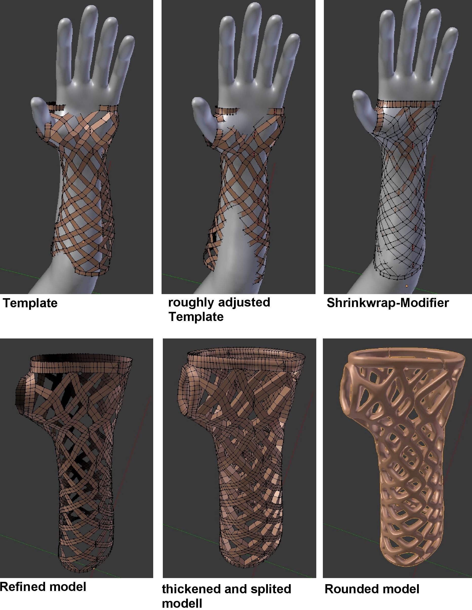

# 3D Printed Cast
This project was developed as part of my studies, with the objective of creating an immobilizing bandage using simple methods based on a 3D scan of an arm, produced with a 3D printer. This type of bandage offers several advantages over traditional casts:
* Water-resistant: Allows for hassle-free showering.
* Lighter: Weighs less than a traditional plaster cast.
* Aesthetically pleasing: Offers a variety of design options.

The manufacturing process I developed aims to provide an easy-to-implement alternative to the commercially available 3D-printed casts offered by  [Activ Armor](https://activarmor.com/).

The process consists of four main steps:

1. Scanning: First, the patient's arm is scanned to create a 3D model.
2. Modeling: Next, this 3D model is used to digitally design a customized orthosis for the patient.
3. Fabrication: The digital model of the orthosis is then produced using an additive manufacturing process.
4. Post-processing: Finally, the manufactured orthosis undergoes post-processing to achieve a smooth surface finish.

## 1. Scanning

The most cost-effective option for 3D scanning is the second-generation Kinect, which can be purchased for under €100. When used in conjunction with the Microsoft application [3D Scan](https://www.microsoft.com/de-de/p/3d-scan/9nblggh68pmc?activetab=pivot:overviewtab)  it allows for three-dimensional scanning of objects without the need for additional markers. To perform the scan, the Kinect is moved around the object.

*3D Scan* created with the Kinect v2

  
## 2. Modeling

The scanned data is further processed, and the actual orthosis is modeled using [Blender](https://www.blender.org/), an open-source software for 3D modeling and animation. To streamline and expedite the design process, a template of the orthosis is utilized. This template is a pre-created Blender model that outlines the basic design of the final orthosis.

During the modeling of the personalized orthosis, the following steps are undertaken:
1. Adapting the Template: Initially, the template is adjusted to fit the patient's scan. This is accomplished in Blender by deforming the template. The "Proportional Editing Mode" allows for neighboring points to move proportionally when a single point is dragged, while the "Snap During Transform" function aligns points to the surface of the scan.
2. Precise Projection: After the rough adjustment, the template is precisely projected onto the scan using the "Shrinkwrap" modifier in "Project" mode.
3. Model Refinement: In the next step, the adapted model is refined using a subsurface modifier. To give the model volume, the "Solidify" modifier is applied. To create two half-shells, the vertex group from the base model is selected along with the corresponding separation points. The edges associated with these points are then selected using the Edge Select tool, followed by an edge split.
Lastly, the model is filleted with another subsurface modifier, this time using the Catmull-Clark mode.
4. Adding Fastening Points: Finally, to enable the joining of the two half-shells later on, screw holes or attachment points for clamps are added, depending on the desired fastening method.

*Modeling Steps

With practice, this entire process can be completed in under 10 minutes.

**Video:**  

## 3. Fabrication

The orthosis is manufactured using 3D printing with the Fused Deposition Modeling (FDM) process, utilizing PLA as the printing material. The orthosis is designed to be printed upright without the need for additional support material. However, strong cooling is essential during the printing process. A nozzle diameter of 0.8 mm and a layer height of 0.4 mm were selected for optimal results.
### Print parameters

* Nozzle diameter: Ø 0.8mm
* Layer height: 0.4 mm

| **Velocity**       |          |                             |         |
|--------------------|----------|-----------------------------|---------|
| Perimeter          | 50 mm/s  | Bridges                     | 50 mm/s |
|               small| 30 mm/s  | Infill                      | 60 mm/s |
| -> external        | 50%      | -> solid                    | 20 mm/s |
| Support Material   | 60 mm/s  | -> top solid                | 15 mm/s |
| -> interface       | 100 %    | -> gaps                     | 20 mm/s |

| **Other**          |          |
|--------------------|----------|
| Vertical Shells    | 2        | 
| Horizontal Shells  | 3        | 
| Brim               | 20 mm    |
|Infill              | 10%      |
|Solid Infill threshold Area | 7 mm²|

**Video:**  

*finished print without post processing*

## 4. Post-processing

To achieve a smooth surface and ensure good wearing comfort, the orthosis requires post-processing after printing. The steps involved are as follows:
1. Roughly cut away excess material and burn off fine threads using a flame.
2. Smooth out rough spots and correct printing errors, particularly in overhang areas, with a heated soldering iron tip.
3. Apply a dip coating to the entire orthosis.

The coating is performed using a common resin intended for 3D printing in the SLA process, which can be cured under UV light in just a few minutes. Two layers of varnish are sufficient to achieve a smooth surface finish. Overall, the entire post-processing procedure takes no more than 15 minutes.

*Curing under UV light

*Final Result*

[imgaes]: Image