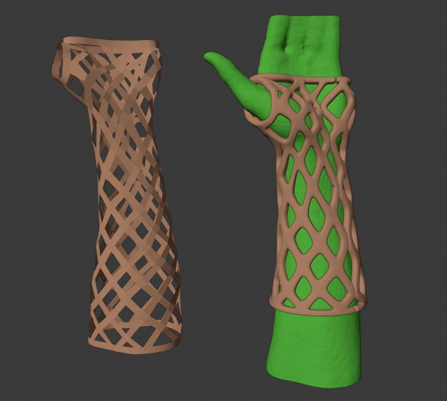
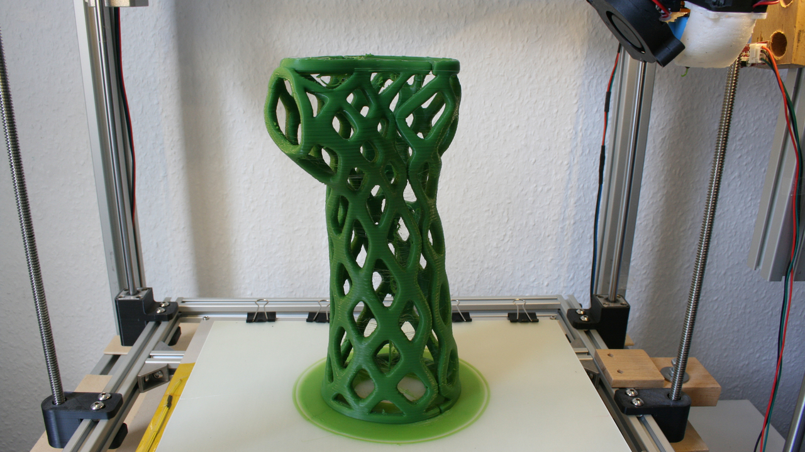

# 3D Printed Cast
This project was created in the course of my studies. The goal was to produce an immobilized bandage with simple means on the basis of a 3D scan of an arm with a 3D printer. Such a bandage has some advantages compared to a conventional bandage: 
* water resistant, showering possible without problems
* Lighter than a plaster cast
* more visually appealing, many designs possible

The developed manufacturing process is intended to be an easy-to-implement alternative to the already commercially offered 3D-printed casts from [Activ Armor](https://activarmor.com/).

The process is divided into four main steps:
1. scanning: First, the patient's arm must be scanned to obtain a 3D model.
2. modeling: the next step is to use this 3D model to digitally model the individual orthosis for the patient.
3. fabrication: Subsequently, the digital model of the orthosis is manufactured using an additive process
4. post-processing: finally, the manufactured orthosis is post-processed to give it a smooth surface.

If you are interested, I can send you my complete thesis.

## 1. Scanning

The cheapest way to 3D scan is the 2nd generation Kinect, for under 100€ it can be used. In combination with the Microsoft application [3D Scan](https://www.microsoft.com/de-de/p/3d-scan/9nblggh68pmc?activetab=pivot:overviewtab) an object can be scanned three-dimensionally without additional markers. To do this, the Kinect is moved around the object.

*3D Scan* created with the Kinect v2

  
## 2. Modeling

Further processing of the scan is done and the modeling of the actual orthosis is done in [Blender](https://www.blender.org/). This is an open source software for three-dimensional modeling and animation. To simplify and accelerate the actual design process, a template of the later orthosis is used. This template is a one-time created Blender model with the basic design of the later orthosis.

In the course of modeling the actual, personal orthosis, now:
1. at the beginning, the template is adapted to the patient scan. This is done in Blender in a rough first step by deforming the template. The two Blender functions "Proportional Editing Mode", which allow neighboring points to move proportionally by dragging a single point, and "Snap During Transform", which snap points to the surface of the scan, are helpful here.
2. once the template is roughly adjusted, the next step is to project it exactly onto the scan using the "Shinkwrap" modifier and the "Project" mode 
3. in the next step this adapted model is refined with a subsurface modifier. In order to obtain a volume, the model is thickened with the SolidifyModifier.
In order to have two half-shells later on, the vertex group stored in the basic model is selected with the points of the separation points, the edges belonging to it are selected by clicking on Edge Select and an edge split is carried out.
Finally, the model is filleted with another subsurface modifier, but this time in Catmull-Clark mode.
6. in order to be able to join the two half-shells together later, screw holes or holding points for clamps, for example, are now added, depending on the desired fastening method.

*Modeling Steps

With this procedure, the complete process takes no more than 10 minutes with a little practice.

**Video:**  

## 3. manufacturing

The othesis is manufactured using 3D printing in the FDM process. PLA is used as the material. The orthosis is modeled in such a way that it can be printed upright without additional support material. However, very strong cooling is important. A nozzle diameter of 0.8 mm and a layer height of 0.4 mm were selected.
### Print parameters

* Nozzle diameter: Ø 0.8mm
* Layer height: 0.4 mm

| **Velocity**       |          |                             |         |
|--------------------|----------|-----------------------------|---------|
| Perimeter          | 50 mm/s  | Bridges                     | 50 mm/s |
|               small| 30 mm/s  | Infill                      | 60 mm/s |
| -> external        | 50%      | -> solid                    | 20 mm/s |
| Support Material   | 60 mm/s  | -> top solid                | 15 mm/s |
| -> interface       | 100 %    | -> gaps                     | 20 mm/s |

| **Other**          |          |
|--------------------|----------|
| Vertical Shells    | 2        | 
| Horizontal Shells  | 3        | 
| Brim               | 20 mm    |
|Infill              | 10%      |
|Solid Infill threshold Area | 7 mm²|

**Video:**  

*finished print without post processing*

## 4. post-processing

In order to achieve a smooth surface and good wearing comfort, the orthosis must be post-processed after printing. The steps to do this are as follows:
1. roughly cut off excess material and flame off fine threads
2. level rough spots and printing errors, e.g. on overhangs, with a hot soldering iron tip
3. dip coating the complete orthosis

The coating is done with common resin used for 3D printing in the SLA process. This can be cured under UV light in a few minutes. Two layers of varnish are sufficient to obtain a smooth surface. 
Thus, the complete post-processing takes no more than 15 minutes.

*Curing under UV light

*Final Result*
