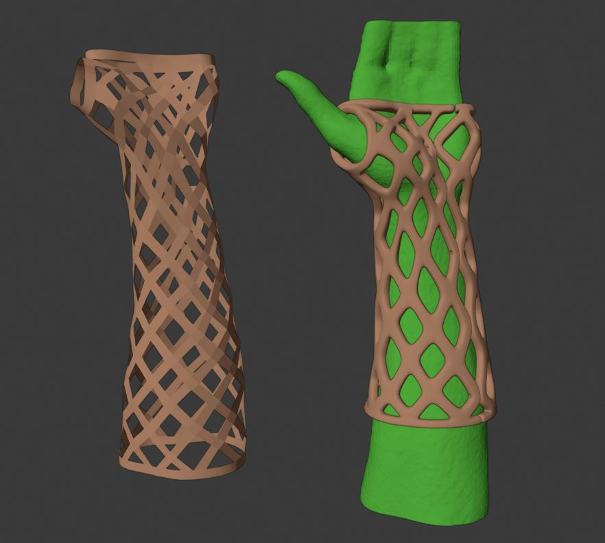
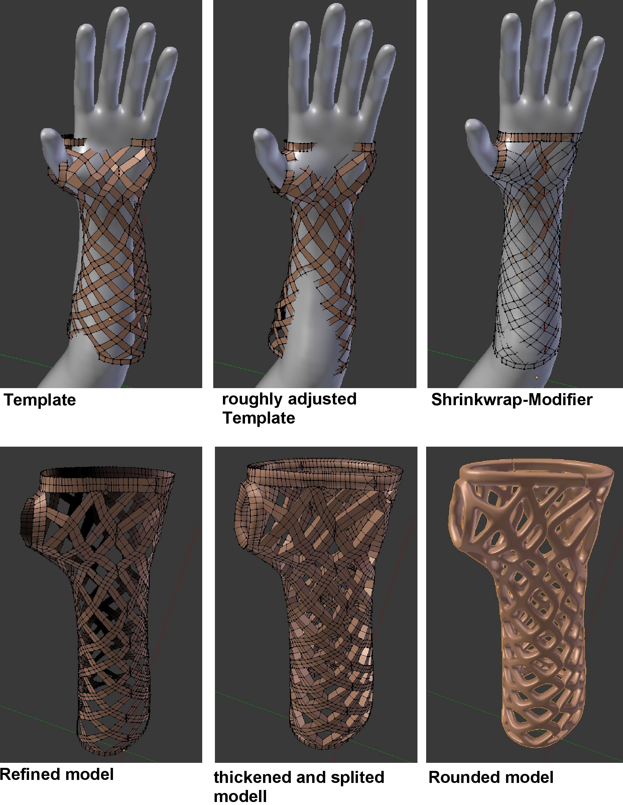
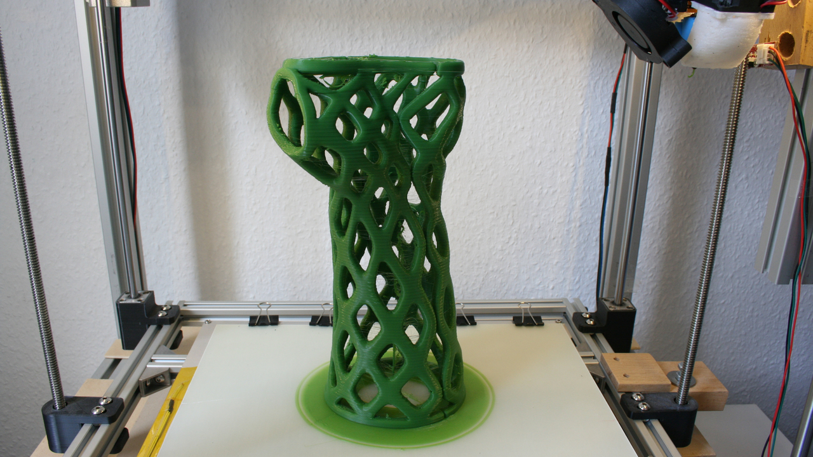
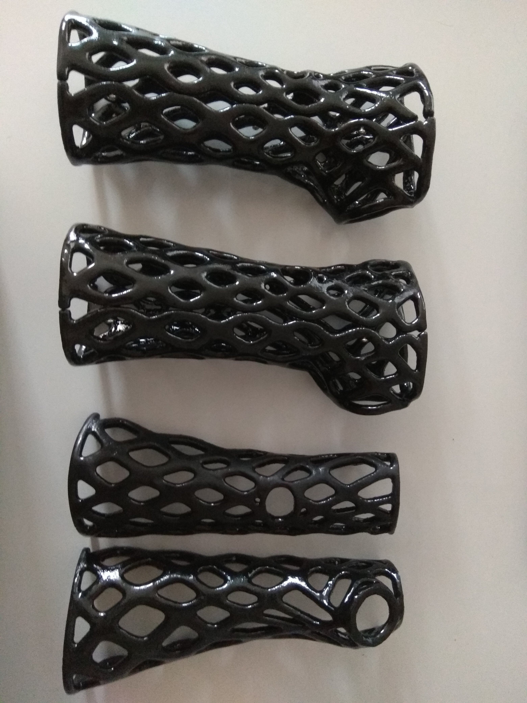

# 3D Printed Cast
Dieses Projekt ist im Zuge meines Studiums entstanden. Ziel war es, mit einfachen Mitteln auf Basis einens 3D Scans eines Arms mit einem 3D Drucker einen immobilsieden Verband zu fertigen. Solch ein Verband hat im Verband hat im Vergleich zu einem konventiellen Verband einigen Vorteile: 
* Wasserbeständig, duschen ohne Probleme möglich
* leichter als ein Gipsverband
* optisch Ansprechender, viele Designs möglich

Der entwickelte Fertigungsprozess soll eine einfach zu realsierende Alternative zu den schon kommerziell angebotenenden 3D-Printed Casts von [Activ Armor](https://activarmor.com/) sein.

Der Prozess gliedert sich in vier wesentliche Schritte:
1. Scannen: Als erstes muss der Arm des Patienten eingescannt werden, um ein 3DModell zu erhalten
2. Modellierung: Im nächsten Schritt wird mit Hilfe dieses 3D-Models die individuelle Orthese für den Patienten digital modelliert.
3. Fertigung: Anschließend wird das digitale Modell der Orthese mittels eines additiven Verfahrens gefertigt
4. Nachbearbeitung: zum Schluss wird die gefertigte Orthese so nachbearbeitet, dass sie eine glatte Oberfläche bekommt

Bei Interesse kann ich dir meine komplette Ausarbeitung zukommen lassen.

## 1. Scannen

Der günstigte Weg zum 3D Scannen ist die Kinect der 2. Generation, für unter 100€ ist sie gebrauucht zu bekommen. In Kombination mit der Microsoft Anwendung [3D Scan](https://www.microsoft.com/de-de/p/3d-scan/9nblggh68pmc?activetab=pivot:overviewtab) können ohne zusätzliche Marker ein Objekt dreidimensional gescannt werden. Dazu wird die Kinect um das Objekt herum bewegt.

*mit der Kinect v2 erstellter 3D Scan*
  
  
## 2. Modellierung

Die weitere Bearbeitung des Scans erfolgt und die Modellierung der eigentliche Orthese erfolgt in [Blender](https://www.blender.org/). Dies ist eine konstelose Open Source Software zur dreidimensionalen Modellierne und Animieren. Um den eigentlichen Designprozess zu vereinfachen und zu Beschleunigen, kommt ein Template der späteren Orthese zum Einsatz. Dieses Template ist ein einmalig erstelltes Blender Modell mit dem Grunddesign der späteren Orthese.

Im Zuges der Modellierung der eigentlichen, persönlichen Orthese, wird nun:
1. Zu Beginn die Vorlage auf den Patientenscan angepasst. Dies erfolgt in Blender in einem groben ersten Schritt durch Verformen der Vorlage. Hilfreich sind dabei die beiden Blender-Funktionen „Proportional Editing Mode“,durch die sich benachbarte Punkte durch Ziehen eines einzelnen Punktes proportional mitbewegen sowie „Snap During Transform“, wodurch Punkte auf der Oberfläche des Scans fangen.
2. Ist die Vorlage grob angepasst, kann sie im nächsten Schritt mit Hilfe des Modifiers „Shinkwrap“ und dem Modus „Project“ genau auf den Scan projiziert werden 
3. Im nächsten Schritt wird dieses angepasste Modell mit einem Subsurface-Modifier verfeinert. Um ein Volumen zu erhalten wird das Modell mit dem SolidifyModifier aufgedickt.
4. Um später zwei Halbschalen zu haben, wird die im Grundmodell hinterlegte Vertex Group mit den Punkten der Trennstellen selektiert, die dazu gehörigen Kanten durch Klick auf Edge Select ausgewählt und ein Edge-Split durchgeführt.
5. Zum Schluss wird das Modell mit einem weiteren Subsurface-Modifier, diesmal aber im Catmull-Clark Modus verrundet.
6. Um die beiden Halbschalen später zusammen fügen zu können, werden nun noch je nach gewünschtem Befestigungsverfahren z.B. Schraubenlöcher oder Haltepunkte für Klammern eingebracht.

*Modeling Steps*

Mit diesem Vorgehen dauert so der komplette Prozess mit etwas Übung nicht länger als 10 Minuten.

**Video:**  

## 3. Fertigung

Die Fertigung der Othesese erfolgt mittels 3D Druck im FDM Verfaren. Als Material kommt PLA zum Einsatz. Die Orthese ist so Modelliert, dass sie stehend ohne zusätzliches Stützmaterial gedruckt werden kann. Wichtig ist dabei allerdings eine sehr starke Kühlung. Als Düsendurchmesser wurden 0,8 mm und eine Schichthöhe von 0,4 mm gewählt.
### Druckparameter

* Düsendurchmesser: Ø 0,8mm
* Schichthöhe: 0,4 mm

| **Velocity**       |          |                             |         |
|--------------------|----------|-----------------------------|---------|
| Perimeter          | 50 mm/s  | Bridges                     | 50 mm/s |
|               small| 30 mm/s  | Infill                      | 60 mm/s |
| -> external        | 50%      | -> solid                    | 20 mm/s |
| Support Material   | 60 mm/s  | -> top solid                | 15 mm/s |
| -> interface       | 100 %    | -> gaps                     | 20 mm/s |

| **Other**          |          |
|--------------------|----------|
| Vertical Shells    | 2        | 
| Horizontal Shells  | 3        | 
| Brim               | 20 mm    |
|Infill              | 10%      |
|Solid Infill threshold Area | 7 mm²|

**Video:**  

*fertiger Druck ohne Nachbearbeitung*

## 4. Nachbearbeitung

Um eine glatte Oberfläche und einen guten Tragekomfort zu erreichen, muss die Orthese nach dem Drucken noch nachberabeitet werden. Die Schritte dazu sehen wie folgt aus:
1. Überstände grob abschneiden und feine Fäden abflammen
2. raue Stellen und Druckfehler z.B. an Überhängen mit einer heißen Lötkolbenspitze einebnen
3. Tauchlackieren der komplette Orthese

Die Lackierung erfolgt mit gewöhnlichem, zum 3D Drucken im SLA Verfahren benutzten Harz. Dieser kann unter UV-Licht in wenigen Minuten ausgehärtet werden. Zwei Schichten Lack sind ausreichend, um eine glatte Oberfläche zu erhalten. 
Die komplette Nachbearbeitung dauert so nicht länger als 15 Minuten.

*Aushärten unter UV Licht*

*Endergebnis*
